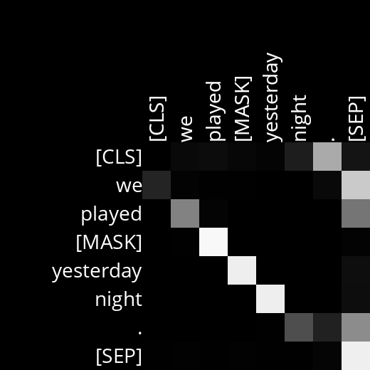
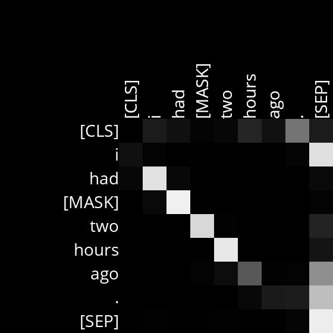
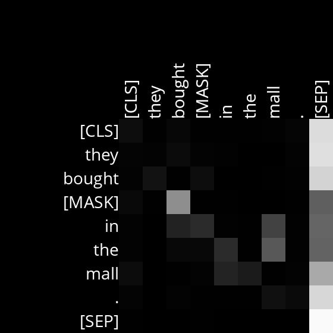
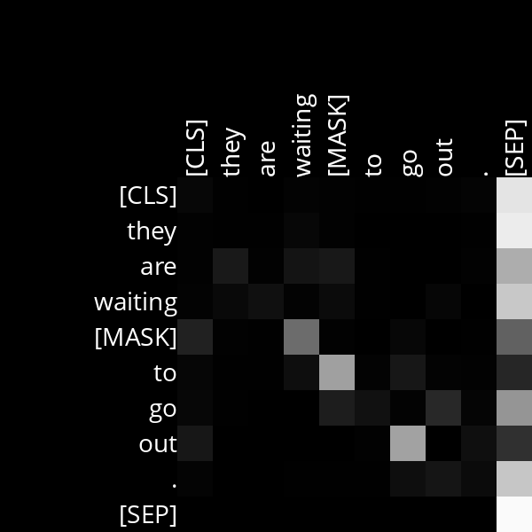

# Analysis

## Layer 7, Head 12

Nessa attention head presente na camada 7 nós podemos perceber que a maioria dos tokens prestam atenção nos tokens que precedem eles. 

Example Sentences:
- We played [MASK] yesterday night.

- I had [MASK] two hours ago.

## Layer 5, Head 8

Nessa attention head presente na camada 5 nós podemos perceber que o palavra após o verbo presta atenção no verbo que precede ele.

Example Sentences:
- They bought [MASK] in the mall.

- They are waiting [MASK] to go out.

